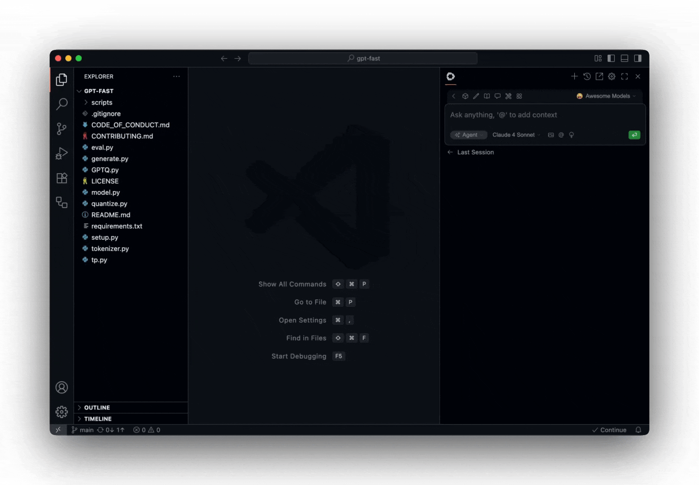
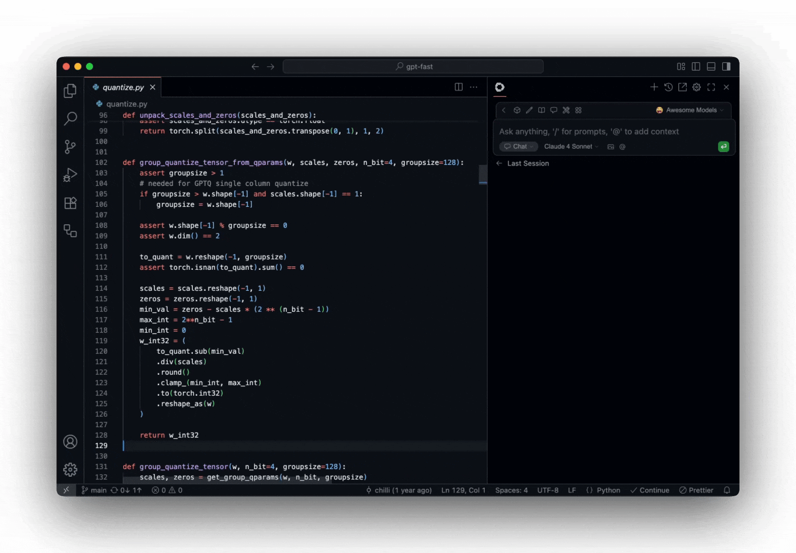
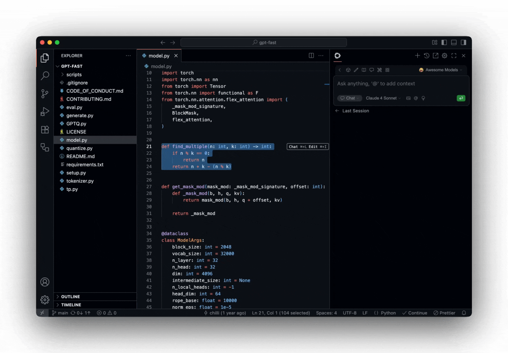
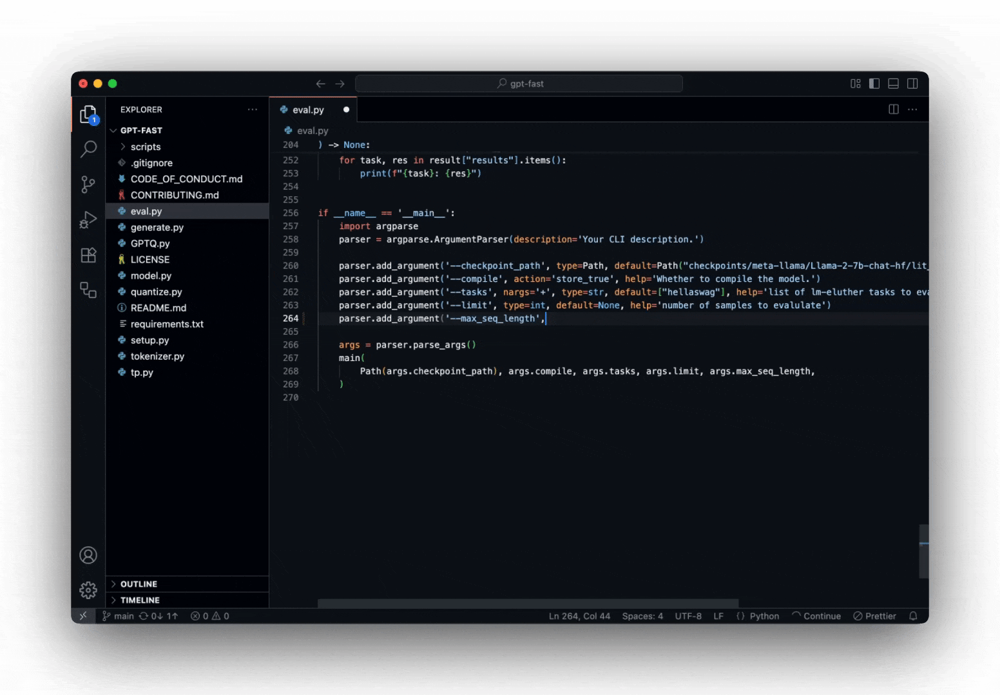

<h1 align="center">AXCode</h1>

**Ship faster with AXCode AI**

**Build and run custom agents across your IDE, terminal, and CI**

Get started in [VS Code](), [JetBrains](), or [CLI]()

## Agent

<!-- [Agent](/features/agent/quick-start) to work on development tasks together with AI

## Chat

[Chat](/features/chat/quick-start) to ask general questions and clarify code sections

## Edit

[Edit](/features/edit/quick-start) to modify a code section without leaving your current file

## Autocomplete

[Autocomplete](/features/autocomplete/quick-start) to receive inline code suggestions as you type

## Contributing

Read the [contributing guide](https://github.com/continuedev/continue/blob/main/CONTRIBUTING.md), and
join [#contribute on Discord](https://discord.gg/vapESyrFmJ). -->

## License

[Apache 2.0 © 2023-2024 SKAXDev, Inc.](./LICENSE)
